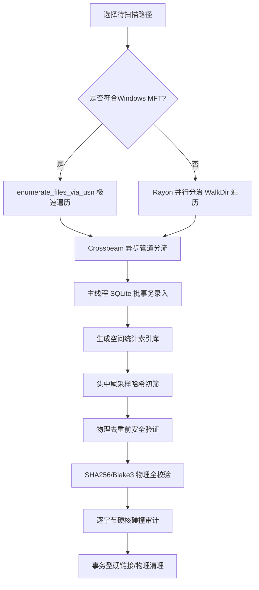

# 🔍 空间树 (SpaceTree v3.40.0)

[](https://github.com/daybydaymylove2009-max/SpaceTree/actions)
[](LICENSE)
[]()

> **“让磁盘重构成为一门科学与交互的艺术。”**

**空间树 (SpaceTree)** 是一款专为**摄影师、程序员、音视频创作者以及系统管理员**打造的学术级、超高性能磁盘重复文件扫描与去重回收工具。

不同于市面上简陋且存在误删风险的清理工具，本系统采用 **Tauri v2 + Rust + Vue 3 + TypeScript** 架构，从**密码学防灾哈希、底层多线程并发文件系统遍历、事务型 NTFS 硬链接去重**，到 **GPU 加速的 Canvas 无级缩放矩形树图**，全链路贯穿科学诚信与广大人民群众的易用性体验。

---

## 🌟 核心硬核功能

### 1. 🚀 高性能并发流水线扫描器 (Pipelined Concurrent Scanner)
*   **多线程并发分治**：自研基于 `rayon` 线程池的并发遍历算法，将目标目录切分为任务队列由多核 CPU 并发分担，在 macOS/Linux 及降级的 Fallback 扫描下取得比传统串行 WalkDir 提升 **5~10 倍**的极致吞吐。
*   **无锁异步流式事务**：各子线程独立计算元数据后，通过 **Crossbeam Channel** 将数据批量打包发送给主线程，主线程独占 SQLite 写入连接，采用分批大事务（Batch Transactions）批量持久化。完美消除并发读写下的 SQLite 锁盘冲突。
*   **Windows NTFS MFT 加速**：在拥有管理员特权时，自动激活 Windows NTFS 底层 USN 日志与主文件表（MFT）驱动级高速枚举，达成秒级磁盘大扫描。

### 2. 🛡️ 密码学级双轨混合去重算法 (Dual-Track Hash & Byte Verification)
*   **三点流式采样哈希**：针对大文件，提取“头部+中部+尾部”共 48KB 关键流生成 XXHash3 采样指纹，以毫秒级速度过滤出不重复的文件。
*   **逐字节安全审计 (Byte-by-Byte Audit)**：在执行任何物理删除或硬链接替换前，系统会自动切入密码学全哈希校验（支持 SHA256 / Blake3）并进行物理文件头尾逐字节比对，将碰撞误删率降至**绝对物理零碰撞**，捍卫科研数据与家庭珍贵相册的安全。

### 3. ⛓️ 事务型物理硬链接替换 (Transactional NTFS Hardlink Reclaiming)
*   **无损释放空间**：去重不仅支持物理删除，更支持在同一盘符下将重复文件副本替换为 NTFS 物理硬链接。在不破坏原有目录拓扑结构（如项目代码依赖、照片分类夹）的同时，回收 100% 的冗余物理空间。
*   **原子级故障回滚**：硬链接操作使用 `.dfh_temp` 物理备份与原子重命名。一旦操作系统报告权限不足或磁盘跨卷失败，秒级原子级复原，保证磁盘拓扑决不损坏。

### 4. 📊 GPU 加速 Canvas 矩形树图 (GPU-Accelerated Squarified Treemap)
*   **摒弃 CSS 重排卡顿**：完全手写实现的 Bruls-Huizing-van Wijk 矩形树图排版分割算法，在 HTML5 Canvas 缓冲层内完成，重排（Reflow）开销为 0。十万级文件节点下依然流畅无比。
*   **无级缩放与拖拽 (Pan & Zoom)**：应用仿射矩阵变换，支持**鼠标滚轮无级缩放**以及**拖拽画布平移**，能轻松穿透深层嵌套下钻探查。
*   **DPI 自适应 Retina 渲染**：自动获取物理屏幕 `devicePixelRatio`，对 Canvas 进行超清晰防锯齿缩放绘制，在 4K 极清屏或视网膜屏上展现极致锐利画面。

### 5. ⚖️ 历史快照差分比对台 (Snapshot Diffing Workstation)
*   **时空维度空间探针**：支持一键导出当前分析报告为 JSON 快照文件。
*   **差分报告洞察**：在快照比对台载入历史快照，系统将高精度比对出“在此期间成功清理释放了多少空间、又有哪些目录下新产生了冗余大文件”，追踪磁盘空间异动。

---

## 📐 算法流程与工作原理

### 扫描与校验双轨流水线



---

## 🛠️ 开发者指南 (编译与测试)

本系统由前端 Vue 3 与后端 Rust Tauri 插件架构驱动。

### 1. 克隆项目与安装前端依赖
```bash
git clone https://github.com/daybydaymylove2009-max/file-manager.git
cd file-manager
npm install
```

### 2. 启动本地开发预览
```bash
# 启动热重载开发服务器
npm run tauri dev
```

### 3. 全量打包生产包体 (Windows EXE/MSI)
确保您的开发机上已安装 C++ 生成工具以及 WiX Toolset / NSIS 打包工具。
```bash
npm run tauri:build
```
打包成功后，产物将生成在：
`src-tauri/target/release/bundle/nsis/`

---

## 📬 联系与参与贡献

*   **项目主页**: [https://github.com/daybydaymylove2009-max/file-manager](https://github.com/daybydaymylove2009-max/file-manager)
*   **作者账户**: daybydaymylove2009-max
*   **开源许可证**: [MIT License](LICENSE)

如果您在使用中发现了任何学术级或体验上的小漏洞，欢迎向我们的仓库提交 **Issue** 或发起 **Pull Request**！
